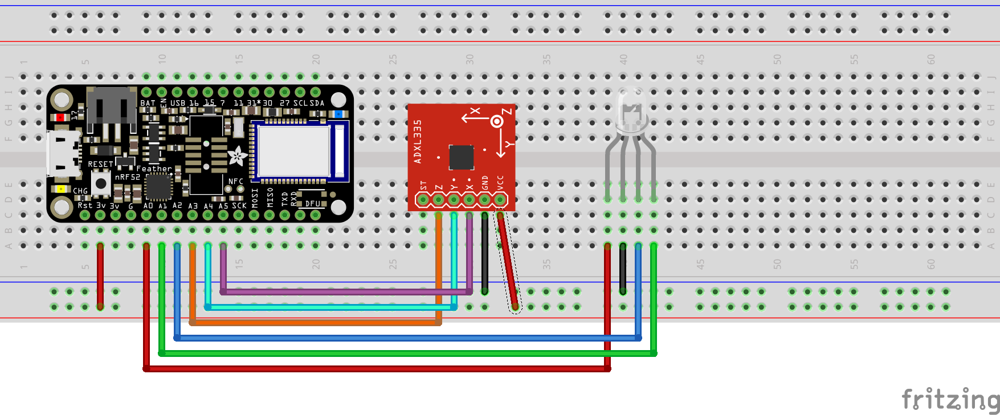

# BLE Feather NRF52
This was a project to demonstrate the connection between a BLE Adafruit microcontroller and Unity.


## Project overview
### Required for project 
#### Hardware
- [Adafruit Feather NRF52](https://learn.adafruit.com/bluefruit-nrf52-feather-learning-guide?view=all)
-  [adxl335 Accelerometer modle](https://www.sparkfun.com/datasheets/Components/SMD/adxl335.pdf)
- RGB LED
#### Software
- [Unity](https://store.unity.com/download) 
- [Unity BLE Plugin](https://assetstore.unity.com/packages/tools/network/bluetooth-le-for-ios-tvos-and-android-26661)

### Aims of Project
- Goal of the project is to demonstrate that any BLE microcontroller will be able to connect to a unity project
- The main example of the BLE Unity library connects a RFDuino module to a unity project, but any BLE device should be able to be connected.
- To Demonstrate this, I will have the device connect via bluetooth LE to the Unity Game runnung on a phone.
- As the device is tilted a cube on the unity program will also tilt.  
- This is the proof of concept mainly to show connection with Unity.



### Unity code
The most important part of the unity code is the connection to BLE
```
private string _FullUID = "6e40****-b5a3-f393-e0a9-e50e24dcca9e"; //Default UUID from adaFruit nrf52
    private string _serviceUUID = "0001"; // service characteristic
    private string _readCharacteristicUUID = "0003"; 
    private string _writeCharacteristicUUID = "0002";
    private string deviceToConnectTo = "_TimsBluefruit52"; //change to name given to module on Arduino code

```
- This is what is defines the device, the FullUID is the UART service definition
- The name of the device is what is defined in the arduino code
- Unity is subscribing to the UART serial read of the arduino and parsing out the XYZ read from the accelerometer.
- The block on the screen in turn changes color to what the LED shows on the RGB arduino

### Materials
<!DOCTYPE html PUBLIC "-//W3C//DTD XHTML 1.0 Transitional//EN" "http://www.w3.org/TR/xhtml1/DTD/xhtml1-transitional.dtd">
<html xmlns="http://www.w3.org/1999/xhtml">
<head>
<meta http-equiv="Content-Type" content="text/html; charset=utf-8" />
<title>Fritzing Bill of Materials</title>
<style type="text/css">
.meta {
	font-size: small;
	margin: 0.4em 0;
}
table {
	border-collapse: collapse;
}
th {
	font-weight: bold;
	text-align: left;
	border-bottom: 1px solid black;
	padding: 0.1em 1.5em 0.2em 0.1em;
}
td {
	border-bottom: 1px solid #CCC;
	padding: 0.5em 1.5em 0.5em 0.1em;
}
.props {
	font-size: smaller;
}
</style>
</head>

<body>
<h1>Bill of Materials: BLE_Unity.fzz</h1>
<p class="meta">BLE_Unity.fzz</p>
<p class="meta">Thursday, May 2 2019, 14:46:02</p>

<h2>Assembly List</h2>
<table>

  <thead>
   <tr>
    <th>Label</th>
    <th>Part Type</th>
    <th>Properties</th>
    </tr>
  </thead>
  <tbody>
  <tr>
    <td>LED1</td>
    <td>RGB LED (com. anode, rbg)</td>
    <td class="props">package 5 mm [THT]; polarity common anode; pin order rbg; rgb RGB</td>
</tr><tr>
    <td>Part1</td>
    <td>Triple Axis Accelerometer Breakout - ADXL335</td>
    <td class="props">chip ADXL; axes 3 (x, y, z)</td>
</tr><tr>
    <td>Part2</td>
    <td>Adafruit Feather nRF52</td>
    <td class="props">variant variant 1; part # Adafruit #3406</td>
</tr>
  </tbody>
</table>
<h2>Shopping List</h2>
<table>
  <thead>
	<tr>
    <th>Amount</th>
    <th>Part Type</th>
    <th>Properties</th>
    </tr>
  </thead>
  <tbody>
<tr>
    <td>1</td>
    <td>RGB LED (com. anode, rbg)</td>
    <td class="props">package 5 mm [THT]; polarity common anode; pin order rbg; rgb RGB</td>
</tr><tr>
    <td>1</td>
    <td>Triple Axis Accelerometer Breakout - ADXL335</td>
    <td class="props">chip ADXL; axes 3 (x, y, z)</td>
</tr><tr>
    <td>1</td>
    <td>Adafruit Feather nRF52</td>
    <td class="props">variant variant 1; part # Adafruit #3406</td>
</tr>
  </tbody>
</table>
<p class="meta"><br/>Exported with Fritzing 0.9.3- http://fritzing.org</p>
</body>
</html>

## KNOWN ISSUES
> Will only work with specified BLE device, will add selection in future development
